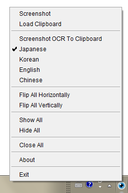

PuppetView is a tool for displaying reference images on screen.

It's made for my own personal use. For similar software, [PureRef](https://www.pureref.com/) and [Kuadro](http://kruelgames.com/tools/kuadro/) are much more powerful.

## Usage

| Operation | Action |
| --- | --- |
| Left MB Drag | Move |
| Wheel | Zoom |
| Shift + Wheel | Zoom proportionally |
| Ctrl + Wheel | Rotate |
| Shift + Ctrl + Wheel | Rotate proportionally |
| Alt + Wheel | Change opacity |
| Double Click | Collapse |