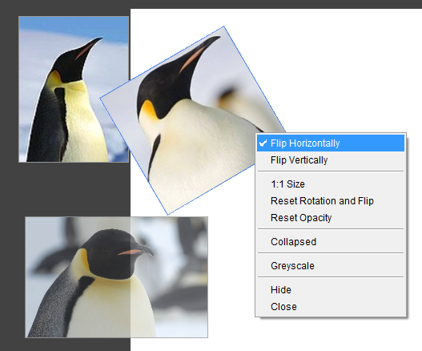

PuppetView is an application for displaying reference images on screen.



## Run

```
mvn clean compile exec:java
```

## Build

```
mvn clean compile assembly:single
```

## Usage

| Button               | Action |
|----------------------| --- |
| Left MB Drag         | Move |
| Wheel                | Zoom |
| Shift + Wheel        | Zoom proportionally |
| Ctrl + Wheel         | Rotate |
| Shift + Ctrl + Wheel | Rotate proportionally |
| Alt + Wheel          | Change opacity |
| Double Click         | Collapse |
